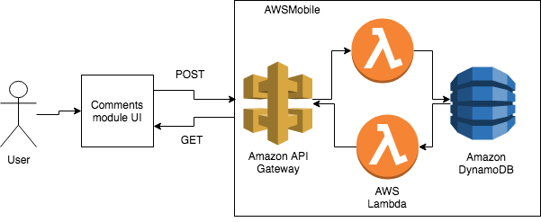

# Comments module

(10% time work)

- Uses serverless backend to store comments

  - Amazon API Gateway
  - AWS Lambda
  - Amazon DynamoDB

- Uses React for frontend
  - git clone git@github.com:rabbiatul-zohra/comments-module.git
  - npm install
  - npm start
